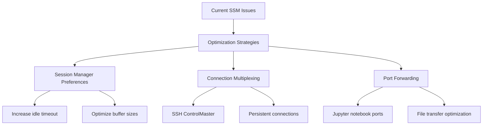

# SSM Session Manager vs SSH: ML Development Workflow Analysis


- **Current Challenge**: Security compliance transition from direct SSH to SSM causing workflow friction


## Current Architecture & Workflow


## Problem Analysis

### Current SSM Limitations


### Security vs Performance Trade-off


## Recommended Solutions

### Option 1: AWS Client VPN (Recommended)


#### ✅ What Client VPN CAN Do:
- **Performance**: Provides native SSH speeds (10-50ms latency)
- **Bandwidth**: Full instance network capacity utilization
- **File Transfers**: Native scp/rsync performance for large ML models
- **VSCode Integration**: Seamless Remote Development Container support
- **Jupyter Notebooks**: Real-time visualization rendering without lag
- **Security**: Private network access without public IP exposure
- **Scalability**: Supports multiple concurrent developer connections
- **Compliance**: Maintains audit trails through VPN connection logs

#### ❌ What Client VPN CANNOT Do:
- **Zero Setup**: Requires VPN client installation on developer machines
- **Instant Access**: Need VPN connection establishment before SSH
- **Cross-Region**: Limited to single region deployment
- **Free Solution**: Incurs hourly endpoint and connection charges
- **Auto-Failover**: No built-in redundancy across AZs
- **Fine-Grained Access**: Cannot restrict access to specific instances via VPN alone

#### 🎯 Why Recommended for ML Team:
- **Critical**: Solves the core performance bottleneck affecting daily workflows
- **ML-Specific**: Handles large file transfers (10GB+ models) efficiently
- **Developer Experience**: Maintains familiar SSH-based development patterns
- **Future-Proof**: Scales with team growth and additional GPU instances

#### ⚠️ Why NOT to Choose:
- **Budget Constraints**: If operational costs are a concern
- **Temporary Usage**: For infrequent or short-term development needs
- **Complex Compliance**: If organization requires zero-trust network model
- **Multi-Region Teams**: If developers are distributed across regions

**Implementation Steps:**
1. Deploy AWS Client VPN Endpoint in development VPC
2. Configure certificate-based authentication
3. Update EC2 instances to private subnets only
4. Modify internal tooling to use private IPs
5. Connect via VPN for development sessions

**Bandwidth**: No AWS-imposed restrictions, limited only by instance network performance

### Option 2: Enhanced SSM Configuration



#### ✅ What Enhanced SSM CAN Do:
- **Immediate Implementation**: No infrastructure changes required
- **Cost-Free**: No additional AWS charges for optimization
- **Connection Reuse**: SSH multiplexing reduces session overhead
- **Timeout Management**: Prevents frequent reconnections
- **Port Forwarding**: Enables Jupyter notebook access
- **Existing Security**: Maintains current compliance posture

#### ❌ What Enhanced SSM CANNOT Do:
- **Fundamental Performance**: Still limited by SSM service latency (100-300ms)
- **Bandwidth Limits**: Cannot exceed SSM service throughput restrictions
- **Large File Transfers**: 10GB+ model downloads remain slow
- **Real-time Visualization**: Jupyter plots still lag significantly
- **Gen-AI Tool Stability**: Connection issues persist with AI coding assistants
- **Native SSH Features**: Some SSH capabilities remain unavailable

#### 🔧 Why Consider This Option:
- **Quick Win**: Can be implemented immediately while planning VPN migration
- **Risk-Free**: No changes to existing security architecture
- **Learning Opportunity**: Helps understand SSM limitations better
- **Interim Solution**: Provides some relief during transition period

#### ❌ Why NOT as Primary Solution:
- **Doesn't Solve Core Issue**: Performance problems remain fundamentally unchanged
- **Developer Frustration**: Team productivity still significantly impacted
- **Temporary Fix**: Will need replacement as team/usage grows
- **Limited ROI**: Effort investment doesn't match performance gains

#### 📋 Migration Checklist:
- [ ] Backup current SSH configurations
- [ ] Update SSM Session Manager preferences
- [ ] Test enhanced SSH config on single developer machine
- [ ] Verify Jupyter notebook port forwarding
- [ ] Update internal tooling scripts
- [ ] Document new connection procedures
- [ ] Train team on new SSH multiplexing features
- [ ] Monitor performance improvements
- [ ] Plan rollback procedure if issues arise

#### Implementation Steps:

**Step 1: Update SSM Session Manager Preferences**
```json
{
  "schemaVersion": "1.0",
  "description": "Document to hold regional settings for Session Manager",
  "sessionType": "Standard_Stream",
  "inputs": {
    "s3BucketName": "",
    "s3KeyPrefix": "",
    "s3EncryptionEnabled": true,
    "cloudWatchLogGroupName": "",
    "cloudWatchEncryptionEnabled": true,
    "idleSessionTimeout": "60",
    "maxSessionDuration": "120",
    "runAsEnabled": false,
    "runAsDefaultUser": "",
    "shellProfile": {
      "windows": "",
      "linux": "exec /bin/bash"
    }
  }
}
```

**Step 2: Optimize SSH Client Configuration**
```bash
# Enhanced ~/.ssh/config
Host devbox-*
    # Connection multiplexing for reuse
    ControlMaster auto
    ControlPath ~/.ssh/control-%r@%h:%p
    ControlPersist 30m
    
    # Keep connections alive
    ServerAliveInterval 30
    ServerAliveCountMax 6
    TCPKeepAlive yes
    
    # Compression for better throughput
    Compression yes
    CompressionLevel 6
    
    # Faster connection establishment
    GSSAPIAuthentication no
    
    # SSM Proxy command
    ProxyCommand sh -c "aws --profile '...' ssm start-session --target %h --document-name AWS-StartSSHSession --parameters 'portNumber=%p'"
```

**Step 3: Configure Port Forwarding for Jupyter**
```bash
# Add to ~/.ssh/config for Jupyter access
Host devbox-jupyter-*
    LocalForward 8888 localhost:8888
    LocalForward 8889 localhost:8889
    LocalForward 6006 localhost:6006  # TensorBoard
    # Include all settings from devbox-* above
```

**Step 4: Update Internal Tooling**
```bash
# Modify tooling to use optimized SSH settings
# Example: Update connection establishment
ssh -o "ControlMaster=auto" -o "ControlPersist=30m" devbox-${INSTANCE_ID}

# For file transfers, use existing connections
scp -o "ControlMaster=auto" large_model.pkl devbox-${INSTANCE_ID}:/workspace/
```

#### What Changes from Current Setup:

**Current State:**
- Basic SSM proxy configuration
- No connection reuse
- Default timeouts (20 minutes idle)
- No compression
- Each SSH command creates new SSM session

**Enhanced State:**
- **Connection Multiplexing**: Reuses existing connections for 30 minutes
- **Extended Timeouts**: 60-minute idle, 120-minute max session
- **Compression**: Reduces data transfer overhead
- **Keep-Alive**: Prevents connection drops during idle periods
- **Port Forwarding**: Direct Jupyter notebook access
- **Optimized Authentication**: Faster connection establishment

#### Implementation Notes:

**⚠️ Important Considerations:**
- **Session Manager Preferences**: Must be configured at AWS account/region level
- **IAM Permissions**: Ensure developers have `ssm:UpdateDocumentDefaultVersion` for preferences
- **SSH Client Version**: Requires OpenSSH 5.6+ for ControlMaster features
- **Firewall/Proxy**: Corporate networks may interfere with multiplexed connections

**🔧 Troubleshooting:**
- **Connection Hangs**: Reduce ControlPersist time or disable ControlMaster
- **Permission Denied**: Check SSM agent version on EC2 instances (requires 3.0+)
- **Port Conflicts**: Adjust LocalForward ports if 8888/8889 are in use
- **Slow File Transfers**: Experiment with CompressionLevel (1-9)

**📊 Expected Improvements:**
- **Connection Time**: 50-70% faster for subsequent connections
- **File Transfer**: 15-25% improvement with compression
- **Session Stability**: Fewer disconnections during idle periods
- **Jupyter Access**: Direct port forwarding eliminates browser proxy issues

**🚀 Quick Implementation (30 minutes):**
1. Update Session Manager preferences via AWS Console
2. Backup and modify ~/.ssh/config on developer machines
3. Test connection multiplexing with `ssh -O check devbox-test`
4. Verify Jupyter port forwarding works
5. Update internal tooling scripts to use optimized settings

### Option 3: Hybrid Approach


#### ✅ What Hybrid Approach CAN Do:
- **Best of Both**: High performance for development, secure access for admin
- **Flexibility**: Different access methods for different use cases
- **Gradual Migration**: Allows phased transition from SSM to VPN
- **Role-Based Access**: Developers use VPN, ops teams use SSM
- **Compliance Balance**: Maintains security while improving productivity
- **Cost Optimization**: VPN only for active development, SSM for occasional admin

#### ❌ What Hybrid Approach CANNOT Do:
- **Simplicity**: Increases complexity with multiple access methods
- **Unified Management**: Requires managing two different connection systems
- **Single Security Model**: Creates multiple attack vectors to monitor
- **Consistent Experience**: Different performance characteristics confuse workflows
- **Easy Troubleshooting**: Issues may span multiple connection types

#### 🎯 Why Consider Hybrid:
- **Risk Mitigation**: Provides fallback if VPN has issues
- **Compliance Flexibility**: Satisfies different security requirements
- **Team Segmentation**: Different roles can use appropriate access methods
- **Migration Strategy**: Enables gradual transition with rollback capability

#### ❌ Why NOT to Choose:
- **Operational Complexity**: Doubles the management overhead
- **Security Confusion**: Multiple access paths increase audit complexity
- **Developer Experience**: Inconsistent performance creates workflow confusion
- **Long-term Maintenance**: Requires ongoing management of both systems

## Performance Comparison

| Metric | Direct SSH | SSM Session Manager | Enhanced SSM | Client VPN + SSH | Hybrid Approach |
|--------|------------|-------------------|--------------|------------------|------------------|
| **Latency** | ~10-50ms | ~100-300ms | ~80-250ms | ~10-50ms | Mixed |
| **Bandwidth** | Full capacity | Limited by SSM | Limited by SSM | Full capacity | Mixed |
| **File Transfer** | Native speed | Very slow | Slow | Native speed | Mixed |
| **Stability** | High | Variable | Improved | High | Variable |
| **Security** | Public access risk | Fully private | Fully private | Private via VPN | Private |
| **Setup Complexity** | Low | Medium | Low | High | Very High |
| **ML Workflow Impact** | None | Severe | Moderate | None | Depends on usage |
| **Compliance** | ❌ Fails | ✅ Passes | ✅ Passes | ✅ Passes | ✅ Passes |
| **Developer Satisfaction** | High | Low | Medium-Low | High | Medium |

### 📊 Real-World Impact for ML Team:

**10GB Model Download Times:**
- Direct SSH: ~5-10 minutes
- SSM Session Manager: ~45-90 minutes
- Enhanced SSM: ~30-60 minutes
- Client VPN + SSH: ~5-10 minutes

**Jupyter Notebook Visualization:**
- Direct SSH: Real-time rendering
- SSM Session Manager: 5-15 second delays
- Enhanced SSM: 3-8 second delays
- Client VPN + SSH: Real-time rendering

## Implementation Roadmap


## Security Considerations


## Troubleshooting Guide

### Common SSM Issues
1. **High Latency**: Use connection multiplexing
2. **Timeouts**: Increase session timeout in preferences
3. **File Transfer**: Use port forwarding for rsync
4. **Gen-AI Instability**: Implement connection retry logic

### VPN Setup Issues
1. **Certificate Problems**: Verify mutual authentication setup
2. **Routing**: Ensure proper route table configuration
3. **DNS**: Configure private DNS resolution

## Decision Framework for Engineers

### Choose AWS Client VPN If:
- ✅ Team downloads/uploads large files (>1GB) regularly
- ✅ Real-time Jupyter visualization is critical
- ✅ Team size is 5+ developers
- ✅ Development workflow performance directly impacts delivery
- ✅ Can invest 2-3 weeks in setup and migration

### Choose Enhanced SSM If:
- ✅ Budget is extremely constrained
- ✅ Usage is infrequent (<10 hours/week per developer)
- ✅ File transfers are small (<100MB typically)
- ✅ Can tolerate 3-5x slower performance
- ✅ Need immediate improvement without infrastructure changes

### Choose Hybrid If:
- ✅ Have distinct developer vs admin roles
- ✅ Want gradual migration with fallback options
- ✅ Complex compliance requirements vary by use case
- ✅ Can manage operational complexity

### Avoid All Options If:
- ❌ Current SSM performance is acceptable to team
- ❌ Security requirements prohibit any network connectivity
- ❌ Team is migrating away from EC2-based development

## Next Steps

### Immediate (Week 1):
1. **Implement Enhanced SSM** configuration for quick wins
2. **Measure current performance** baselines (latency, transfer speeds)
3. **Survey team** on specific pain points and usage patterns

### Short-term (Weeks 2-4):
1. **Pilot AWS Client VPN** with 2-3 developers
2. **Compare performance metrics** between SSM and VPN
3. **Evaluate operational impact** and productivity gains

### Long-term (Month 2+):
1. **Full VPN migration** based on pilot results
2. **Deprecate SSM** for development workflows
3. **Monitor and optimize** VPN performance

## Questions for Deep Dive Session

1. What are the specific compliance requirements driving the SSH restriction?
2. Are there budget constraints for the VPN solution?
3. How many concurrent developers need access?
4. What are the typical file sizes being transferred?
5. Are there any network policies that might affect VPN implementation?

---

